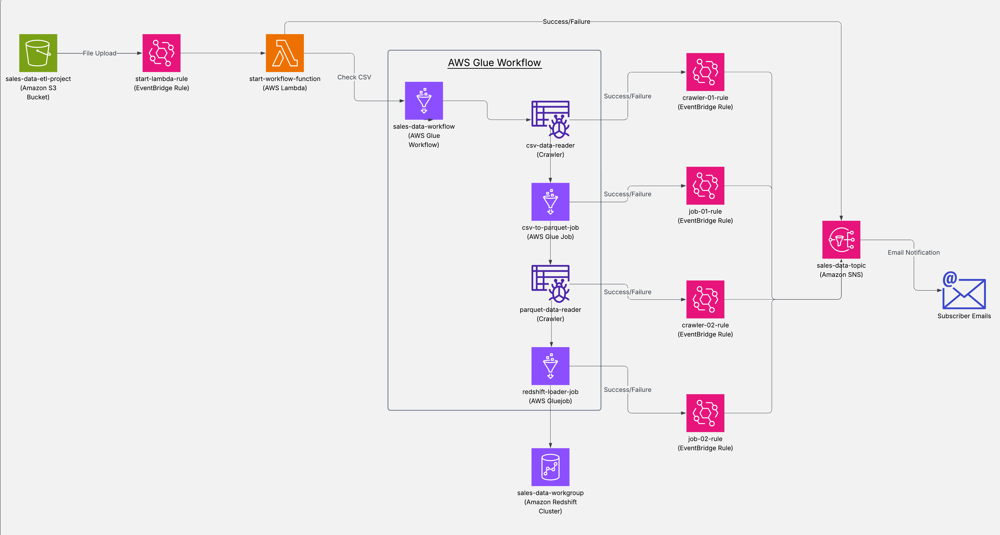

# Aws-S3-to-Redshif-Etl-pipeline
Automated serverless ETL pipeline built on AWS.In this project, the transformation of CSV data ingested into S3 is performed using  AWS Lambda to trigger AWS Glue Workflow containing Crawlers and Spark ETL jobs.

## Project Overview

This project implements a robust and automated Extract, Transform, Load (ETL) pipeline on AWS. It is designed to process new CSV files uploaded to an S3 bucket, transform them into a standardised Parquet format with selected columns, and then load the refined data into an Amazon Redshift data warehouse for analytical querying. The entire process is event-driven, ensuring efficient and timely data processing.

## Architecture

The pipeline leverages several AWS services orchestrated into a seamless workflow:

1.  **S3 Event Trigger:** An S3 bucket (`sales-data-etl-project-bucket`) is configured to emit an event via EventBridge whenever a new CSV file is uploaded to its `input/` prefix.
2.  **AWS Lambda Activation:** This S3 event triggers an AWS Lambda function (`start_workflow_function`).
3.  **Glue Workflow Initiation:** The Lambda function initiates an AWS Glue Workflow (`SalesData_Workflow`).
4.  **Glue Workflow Steps:**
    * **Crawler 1 (Input CSV):** A Glue Crawler (`csv_to_parquet_job`) crawls the `input/` folder of the S3 bucket to discover the schema of the newly added CSV file.
    * **Glue Job 1 (CSV to Parquet):** A Glue ETL Job (`csv`) reads the CSV data, performs validation (e.g., checks if it's indeed a CSV), selects specific columns, and transforms the data into Parquet format. The processed data is then saved into an `output/` folder of the same S3 bucket (`sales-data-etl-project-bucket`).
    * **Crawler 2 (Output Parquet):** Another Glue Crawler (`parquet_data_reader`) crawls the `output/` folder to infer the schema of the newly generated Parquet files.
    * **Glue Job 2 (Parquet to Redshift):** A second Glue ETL Job (`redshift_loader_job`) reads the Parquet data from the `output/` folder and loads it into a specified table in your Amazon Redshift cluster (`sales_data_workgroup`).
5.  **SNS Notifications:** Amazon SNS is integrated to provide notifications for the Lambda function execution status, as well as the completion and failure states of both Glue Crawlers and Glue Jobs within the workflow.

### Architecture Diagram



## AWS Services Used

* **Amazon S3:** Input and output data storage.
* **EventBridge:** Rules to invoke lambda function and publish in  sns topic.
* **AWS Lambda:** Event-driven function to trigger the Glue workflow.
* **AWS Glue:**
    * **Crawlers:** Schema discovery for CSV and Parquet.
    * **Jobs:** Data transformation (CSV to Parquet) and loading (Parquet to Redshift).
    * **Workflow:** Orchestration of crawlers and jobs.
* **Amazon Redshift:** Data warehouse for final analytical data.
* **Amazon SNS:** Notification service for operational alerts.
* **AWS IAM:** For managing permissions between services.
* **Amazon CloudWatch:** For managing Logs

## Prerequisites

Before deploying this project, ensure you have the following:

* An AWS Account with administrative access or appropriate IAM permissions.
* Basic understanding of AWS S3, EventBridge, VPC Endpoint, SNS, IAM, CloudWatch, Lambda, Glue, and Redshift.

## Setup and Deployment

1.  **Create S3 Buckets:**
    * Project Bucket Name: 'sales-data-etl-project-bucket'
    * Input Bucket: `sales-data-etl-project-bucket/input/ ` 
    * Output Bucket: `sales-data-etl-project-bucket/output/` 
    * Glue Scripts Bucket: `aws-glue-asset/scripts/` 
2.  **Create IAM Roles:**
    * Create IAM Role for Lambda ( Glue and CloudWatch permissions).
    * Create IAM Role for Crawlers(with S3 read/write, Glue permissions,CloudWatch permissions).
    * Create IAM Role for job 1:(with s3 read/write,CloudWatch and specific glue permissions).
    * Create IAM Role for job 2 :(with s3 read/write ,CloudWatch,SecretManager,KMS,VPC and specific glue permissions).
    * Create IAM Role for Redshift:(with  s3 read/write,KMS permissions).
    * create IAM Role for EventBridge Rules (with Lambda and SNS permissions).
3.  **Configure Lambda Function:** 
    * Create Lambda function (`start_workflow_function`).
    * Link it to the S3 eventBridge Rule triggerlamdaFunctionRule (Input Bucket `input/` prefix).
    * Set runtime, handler, and assign Lambda IAM Role.

4.  **Create Glue Crawlers:**
    * **Input CSV Crawler:**
    * Create Crawler (`csv_data_reader`). 
    * DataSource:`s3://sales-data-etl-project-bucket/input/`.Assign Crawler  IAM Role(`Role_for_crawler`).
    * Output and Scheduling :Target DataBase (`db_01`) and On demand scheduling.
    * **Output Parquet Crawler:** 
    * Create Crawler (`parquet_data_reader`).
    * Data Source : `s3://sales-data-etl-project-bucket/output/`. Assign Crawler IAM Role(Role_for_crawler).
    * Output and Scheduling :Target DataBase (`db_01`)
5.  **Create Glue Jobs:**
    * **CSV to Parquet Job:**
    * Create job :(`csv_to_parquet_job`).Assign Glue IAM Role. Configure arguments for input/output paths.
    * **Parquet to Redshift Job:**
    * Create job :(`redshift_loader_job`).Assign Glue IAM Role. Configure arguments for Redshift connection, table name.
6.  **Create Glue Workflow:**
    * Define a workflow (`SalesData_workflow`) that orchestrates the crawlers and jobs in the correct sequence.
    * Include events/triggers between steps (e.g., Crawler 1 finishes -> Job 1 starts).
7.  **Configure SNS Notifications:**
    * Create SNS topics for Lambda status, Glue  crawlers and jobs success/failure.
    * Configure Lambda, Glue jobs, and crawlers to publish to these SNS topics.
8.  **Create EventBridge Rules:**
    * create EventBridge Rule: (`triggerLamdaRule,crawler01_rule,job01_rule,crawler02_rule,job02_rule`).With appropriate pattern matching and respective IAM role.
9. **Set up Redshift:**
    * Ensure your Redshift cluster is running and accessible from Glue via Glue Connection(`SalesDataRedshift_connection`).
    * Create the target table (`sales_data_table`)in Redshift that the `redshift_loader_job` will load data into.

## Usage

1.  **Prepare a CSV File:** Ensure your CSV file has the expected columns.
2.  **Upload to S3:** Upload your CSV file to the S3 input bucket's `input/` prefix:
    `s3://sales-data-etl-project-bucket/input/SampleSalesData.csv`
3.  **Monitor Progress:**
    * Check AWS CloudWatch Logs for your Lambda function.
    * Monitor the Glue Workflow execution in the AWS Glue console.
    * Check your subscribed SNS endpoints for notifications on job status.
4.  **Verify Data in Redshift:**
    Once the Glue workflow completes successfully, query your Redshift table to confirm the data has been loaded.

    ```sql
    SELECT * FROM sales_data_table LIMIT 10;
    ```
